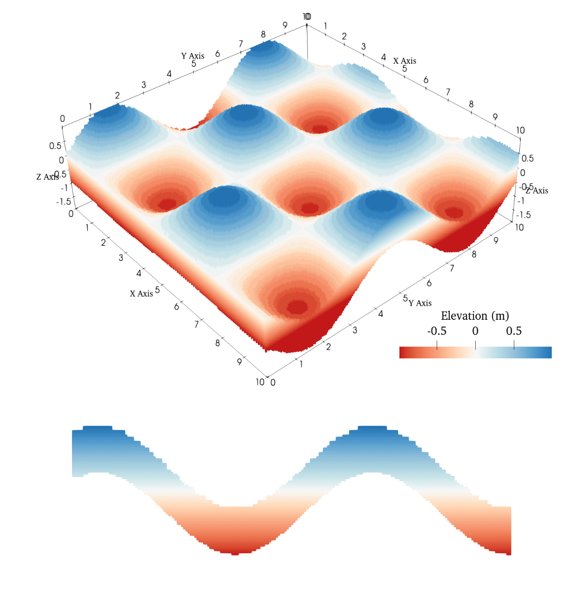

# ***MaterialPointGenerator*** 

[](https://github.com/LandslideSIM/MaterialPointGenerator.jl/actions/workflows/ci.yml) 
[](https://LandslideSIM.github.io/MaterialPointGenerator.jl/stable)
[]()

During the EGU2023 conference, when I presented a high-performance MPM  (Material Point Method) solver, I was asked, 
"How do you discretize the computational model for the MPM?" I didn't have a clear answer (I didn't even consider it a problem) because the models were relatively simple and could be generated directly using some straightforward functions. However, as computational models gradually became more complex and diverse, I began to realize that this was indeed a very good question. The preprocessing for MPM should not be a computationally intensive task; it should be fast enough. Yet, I couldn't find a "plug-and-play" generalized code for this purpose. Some literatures have contributed to this issue, and I built upon their work to create a comprehensive and refined julia package. 

<blockquote style="border-left: 4px solid #ccc; padding-left: 10px;">
  No parallelization, no problem—5,334,808 particles from an STL file (998,137 triangles) in just 
  <strong style="color: red;">0.6 s</strong>. <br>
  <p style="color: gray;">Intel(R) Core(TM) i9-10900K CPU @ 3.70GHz</p>
</blockquote>

## Installation ⚙️

Just type <kbd>]</kbd> in Julia's  `REPL`:

```julia
julia> ]
(@1.11) Pkg> add MaterialPointGenerator
```

## Features ✨

- [x] Structured (regular) coordinates
- [x] Support complicated 2/3D models
- [x] Particle generation from a Digital Elevation Model (DEM) file  
- [x] Automatically interpolate DEM files with support for shape trimming.

## Showcases 🎲

| 3D phoenix and dragon |  DEM with thickness | complex 2D |
|:--------:|:--------:|:--------:|
|  |  |  |

| 2D landslide profile with geological structure (`nid`) |
|:--------:|
|  |

## Acknowledgement 👍

This project is sponserd by [Risk Group | Université de Lausanne](https://wp.unil.ch/risk/) and [China Scholarship Council [中国国家留学基金管理委员会]](https://www.csc.edu.cn/).