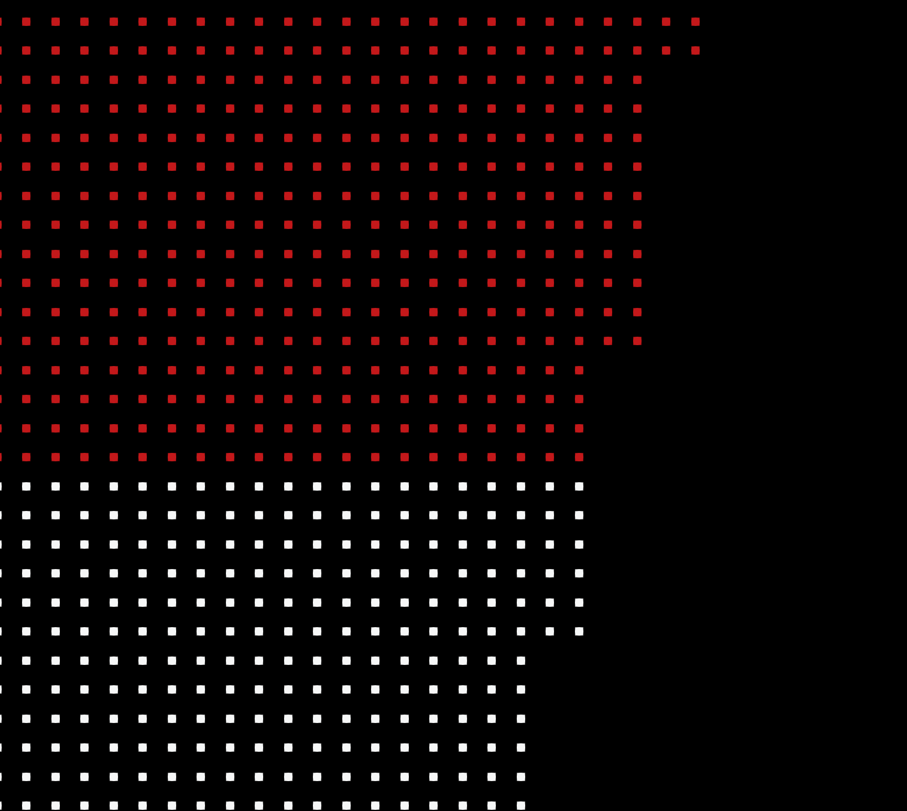

# Polygon

!!! note

    All example files can be found at `assets/2d_nid` [https://github.com/LandslideSIM/MaterialPointGenerator.jl](https://github.com/LandslideSIM/MaterialPointGenerator.jl).


First, we obtained the `.stl` and `.msh` files of the model through Gmsh. The `.msh` file is used to identify the partition information within the model.

```julia
using MaterialPointGenerator

src_dir     = joinpath(@__DIR__, "assets/2d_nid")
stl_file    = joinpath(src_dir , "2d_nid.stl")
msh_file    = joinpath(src_dir , "2d_nid.msh")
nid_file    = joinpath(src_dir , "2d_nid.nid")
output_file = joinpath(src_dir , "2d_nid.xy")

polygon2particle(stl_file, msh_file, output_file, nid_file, 0.001, verbose=true)
```

Note that this will generate two files, namely `.nid` and `.xy`. We can visualize this result to obtain the following outcome:


In this example, we have a total of three partitions. A partially enlarged image:

