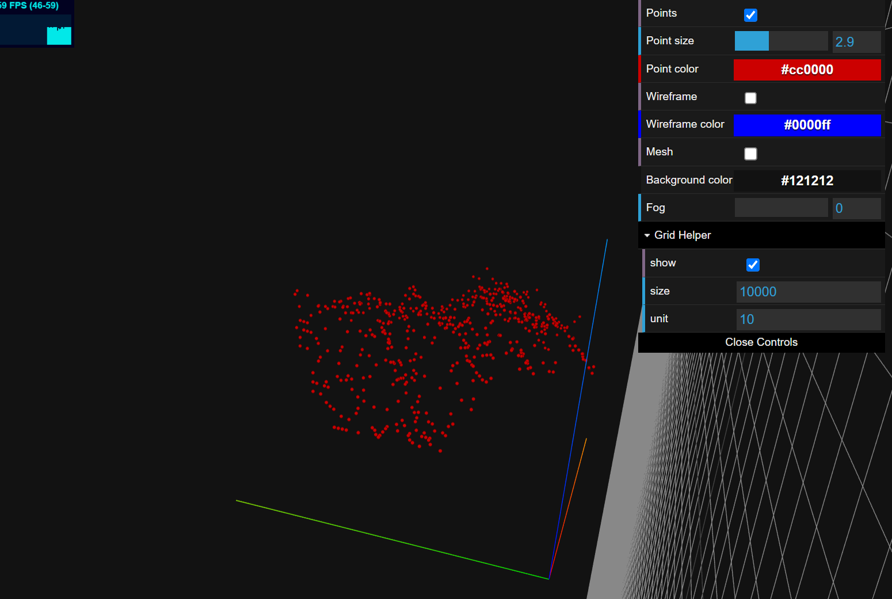
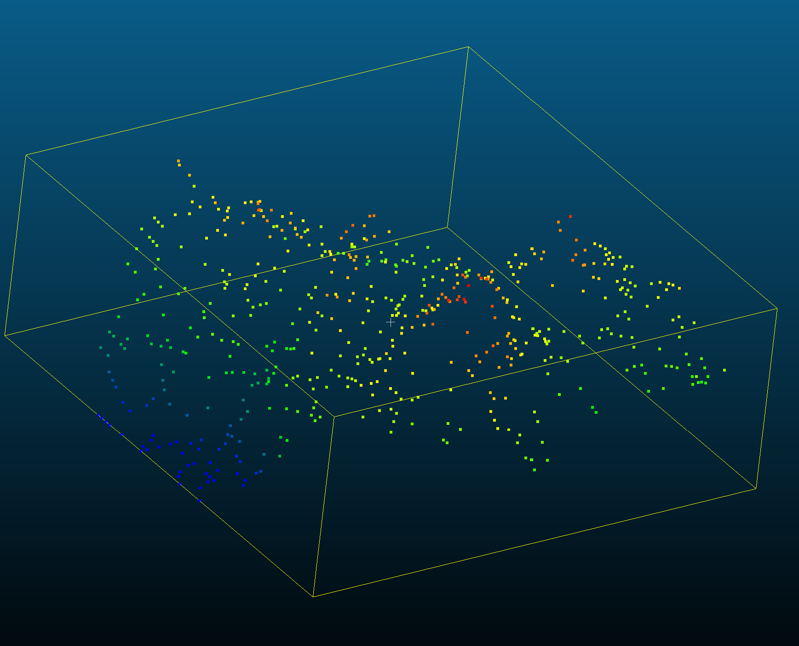
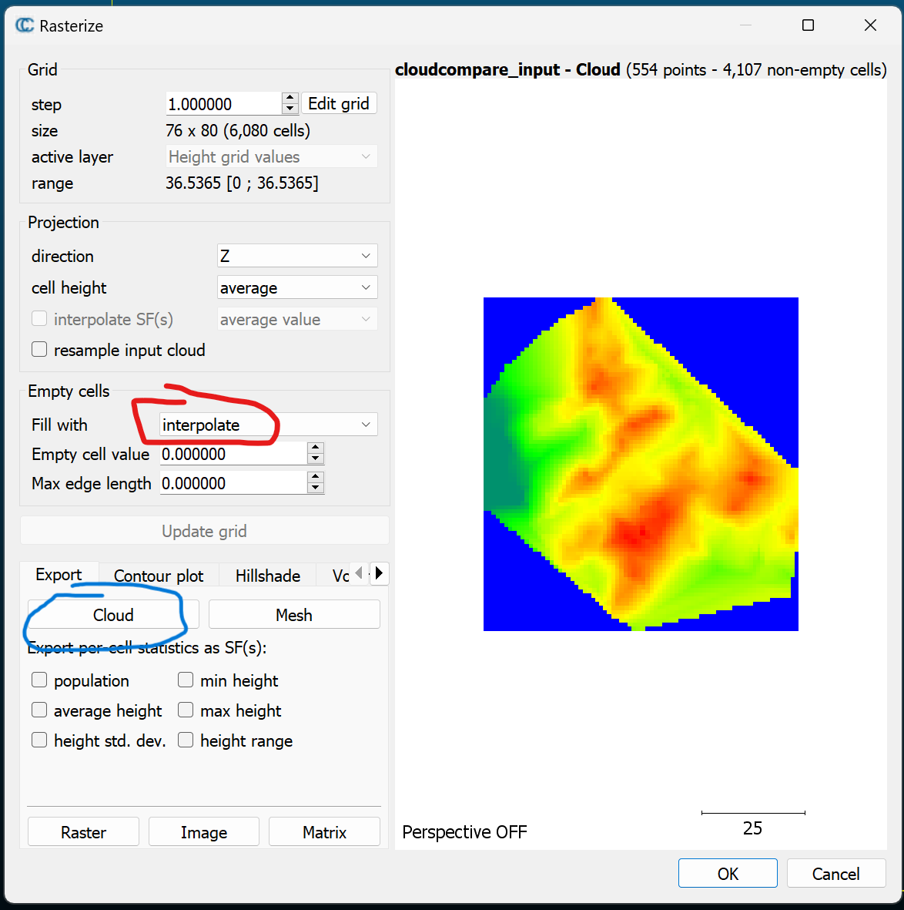
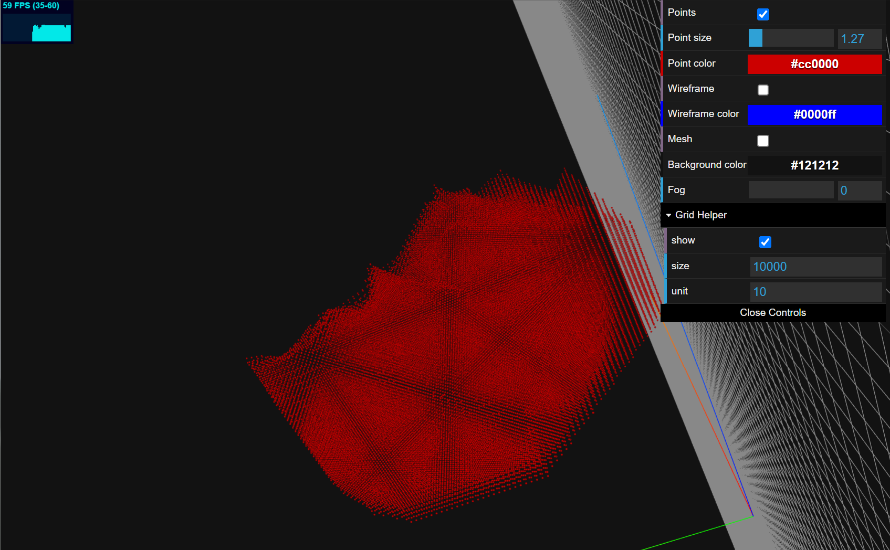

# Case 3 (Workflow "3D Point Cloud")

## Data Preperation

Please check the file `/docs/src/assets/w3_case/cloudcompare_input.xyz`. This file can be seen as the scanning from drone or other devices. The particles are not uniformed, as shown follow:



## Step 1. Let's import this file into CloudCompare



We choose `rasterize` on the point cloud:




!!! info
    Here we need to note that: 1) empty cells fill with `Interpolate` to get structured cloud on X-Y plane, and 2) users need to find the best parameter of grid (step and range)

!!! tip
    We can generate mesh and than using sampling to change the density of point cloud. 

Export cloud points as `cloudcompare_output.ply`.

!!! tip
    We can use MeshLab to delete the blue (bottom) particles and convert to `.xyz` file.

You can find this file from `/docs/src/assets/w3_case/cloudcompare_output.xyz`,
and it looks like this:


## Step 2. Using MaterialPointGenerator.jl

```julia
using MaterialPointGenerator

# define the input and output path
data_path = joinpath(@__DIR__, "../examples/cloudcompare_output.xyz")
output_path = joinpath(@__DIR__, "../examples/test_output.xyz")

# read the point cloud data
data = read_pointcloud(data_path)

# generate the material points
mp = mp_generate(data, 0.0)

# write the material points to the output path
write_pointcloud(mp, output_path)
```

And then, you can see the output result:



You can find this file from `/docs/src/assets/w3_case/test_output.xyz`.